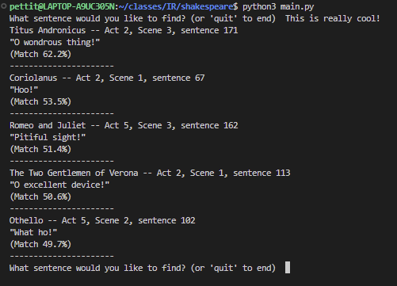

# shakespeare
470 Info Storage and Retrieval Final Project

This is a Shakespeare Line Finder! Give us your "best guess" of a shakespeare quote you don't quite remember, and we'll find the closest match from all of his plays.

# Dependencies

The following will need to be installed with pip:

```
numpy
sentence_transformers
scikit-learn
```

# How to use:

You can run the project with:
`python3 main.py`

This will enter a loop where you can repeatedly search for matches to sentences. You can break the loop and end the program by entering `quit`.
The repeated nature of the search loop can help you refine your search iteratively to find the exact line you're looking for.

# Demo

